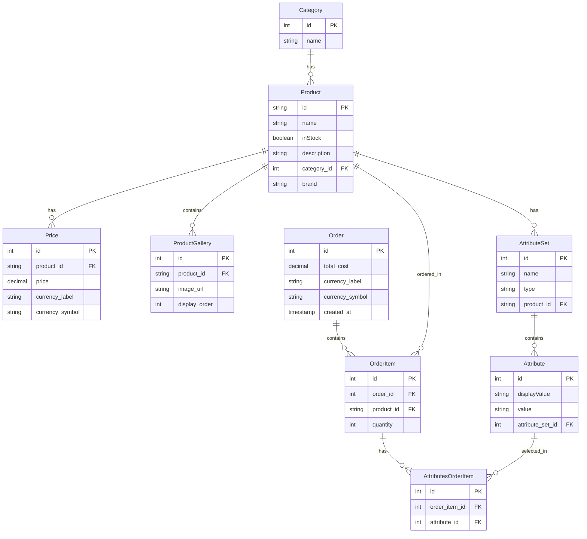

# ScandiWeb E-commerce Full-Stack Application

A modern, full-stack e-commerce application built with React, PHP, GraphQL, and MySQL. This project demonstrates a complete e-commerce solution with product management, shopping cart functionality, and order processing.

## 🚀 Features

### Frontend Features
- **Modern React UI**: Built with React 19, TypeScript, and Vite for optimal performance
- **Responsive Design**: Mobile-first approach with CSS modules
- **Product Catalog**: Browse products by categories with filtering
- **Product Details**: Detailed product pages with image galleries and attribute selection
- **Shopping Cart**: Persistent cart with attribute-based product variants
- **Real-time Updates**: Apollo Client for efficient GraphQL data fetching
- **Client-side Routing**: React Router for seamless navigation

### Backend Features
- **GraphQL API**: Flexible and efficient data querying with webonyx/graphql-php
- **RESTful Architecture**: Clean API design with proper error handling
- **Database Management**: MySQL with optimized queries and relationships
- **Logging System**: Comprehensive logging with Monolog

### E-commerce Features
- **Product Management**: Complete product lifecycle with categories, attributes, and pricing
- **Attribute System**: Flexible product attributes (text, swatch) with multiple values
- **Image Gallery**: Multiple product images with ordering
- **Inventory Tracking**: Stock management with in-stock indicators
- **Order Processing**: Complete order workflow with item tracking
- **Price Management**: Multi-currency support with separate pricing table
- **Audit Trail**: Order timestamps and attribute history tracking

## 🛠️ Tech Stack

### Frontend
- **React 19** - Modern UI library
- **TypeScript** - Type-safe development
- **Vite** - Fast build tool and dev server
- **Apollo Client** - GraphQL client
- **React Router DOM** - Client-side routing
- **React Use Cart** - Shopping cart management
- **CSS Modules** - Scoped styling

### Backend
- **PHP 8** - Server-side language
- **GraphQL-PHP** - GraphQL implementation
- **Fast Route** - High-performance routing
- **Monolog** - Logging framework
- **Apache** - Web server

### Database
- **MySQL 8.0** - Relational database
- **Persistent Storage** - Docker volumes for data persistence

### DevOps
- **Docker** - Containerization
- **Docker Compose** - Multi-container orchestration
- **phpMyAdmin** - Database management interface

## 📊 Entity Relationship Diagram



## 🏗️ Architecture Highlights

1. **String Product IDs**: Products use VARCHAR(100) as primary key for flexibility
2. **Separate Pricing**: Dedicated pricing table allowing for price history and multiple currencies
3. **Product-Specific Attributes**: Each product has its own attribute sets and values
4. **Image Gallery**: Products can have multiple images with ordering
5. **Category Management**: Simple category system with product categorization
6. **Order Management**: Complete order tracking with items and selected attributes
7. **Attribute History**: Tracks which specific attributes were selected for each order item
8. **Audit Trail**: Orders include creation timestamps for tracking

## 🚀 Development Setup

### Prerequisites
- Docker and Docker Compose
- Git

### Installation

1. **Clone the repository**
   ```bash
   git clone <repository-url>
   cd ScandiWeb-TestAssignment
   ```

2. **Set up environment variables**
   ```bash
   cp .env.example .env
   ```

   Edit `.env` file with your configuration:
   ```env
   # Database Configuration
   MYSQL_HOST=db
   MYSQL_USER=scandiweb_user
   MYSQL_PASSWORD=your_password
   MYSQL_DATABASE=scandiweb_db
   MYSQL_ROOT_PASSWORD=root_password

   # Frontend Configuration
   VITE_GRAPHQL_URI=http://localhost:8000/graphql

   # Backend Configuration
   ALLOWED_ORIGINS=http://localhost,http://your-domain.com
   ```

3. **Start the development environment**
   ```bash
   docker-compose up --build
   ```

4. **Access the application**
   - **Frontend**: http://localhost:5137
   - **Backend API**: http://localhost:8000/graphql
   - **phpMyAdmin**: http://localhost:8001

## 📁 Project Structure

```
ScandiWeb-TestAssignment/
├── frontend/                 # React frontend application
│   ├── src/
│   │   ├── components/      # React components
│   │   ├── GraphQL/         # GraphQL queries and mutations
│   │   ├── interfaces/      # TypeScript interfaces
│   │   └── assets/          # Static assets
│   ├── Dockerfile           # Frontend container configuration
│   └── package.json         # Frontend dependencies
├── backend/                  # PHP backend application
│   ├── src/
│   │   ├── Controller/      # GraphQL controller
│   │   ├── Model/           # Data models
│   │   ├── Service/         # Business logic services
│   │   └── TypeDefinitions/ # GraphQL type definitions
│   ├── Dockerfile           # Backend container configuration
│   └── composer.json        # PHP dependencies
├── db/                      # Database initialization
│   ├── 01-schema.sql        # Database schema
│   └── 02-seed.sql          # Sample data
├── docker-compose.yml       # Multi-container orchestration
└── README.md               # This file
```

## 🔧 Development

### Running in Development Mode

1. **Frontend Development**
   ```bash
   cd frontend
   npm install
   npm run dev
   ```

2. **Backend Development**
   ```bash
   cd backend
   composer install
   # Configure your local PHP environment
   ```

### Database Management

- **Access phpMyAdmin**: http://localhost:8001
- **Direct MySQL access**:
  ```bash
  docker exec -it scandiweb_mysql mysql -u root -p
  ```

## 📝 API Documentation

### GraphQL Endpoint
- **URL**: `http://localhost:8000/graphql`
- **Method**: POST
- **Content-Type**: application/json

### Example Queries

**Get Products by Category**
```graphql
query GetProductsByCategory($categoryName: String!) {
  products(categoryName: $categoryName) {
    id
    name
    brand
    inStock
    price {
      amount
      symbol
    }
    gallery {
      url
      order
    }
  }
}
```

**Get Product Details**
```graphql
query GetProductById($id: String!) {
  product(id: $id) {
    id
    name
    brand
    description
    inStock
    price {
      amount
      symbol
    }
    gallery {
      url
      order
    }
    attributeSets {
      name
      type
      attributes {
        id
        value
        displayValue
      }
    }
  }
}
```

## 🤝 Contributing

1. Fork the repository
2. Create a feature branch (`git checkout -b feature/amazing-feature`)
3. Commit your changes (`git commit -m 'Add some amazing feature'`)
4. Push to the branch (`git push origin feature/amazing-feature`)
5. Open a Pull Request

**Built with ❤️ using modern web technologies**
