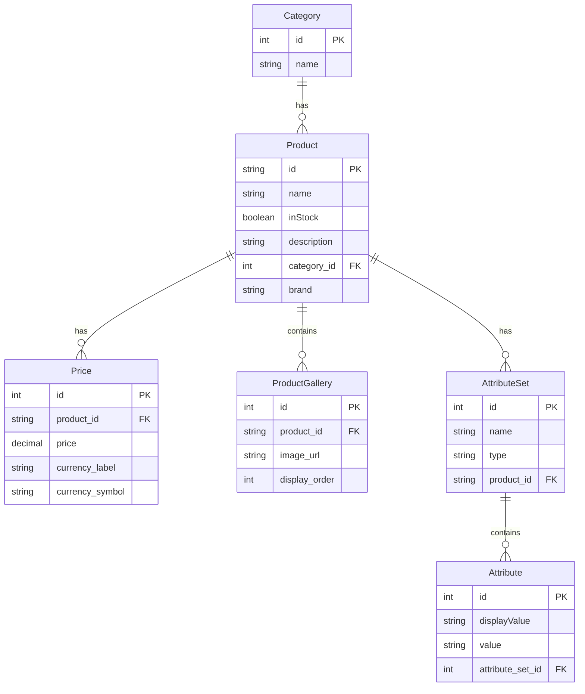

# E-commerce System Entity Relationship Diagram
## Entity Relationship Diagram



## Database Schema

### Tables

#### 1. categories
```sql
CREATE TABLE categories (
    id INT AUTO_INCREMENT PRIMARY KEY,
    name VARCHAR(50) NOT NULL
);
```

#### 2. products
```sql
CREATE TABLE products (
    id VARCHAR(100) PRIMARY KEY,
    name VARCHAR(255) NOT NULL,
    inStock BOOLEAN DEFAULT true,
    description TEXT,
    category_id INT,
    brand VARCHAR(100),
    FOREIGN KEY (category_id) REFERENCES categories(id)
);
```

#### 3. prices
```sql
CREATE TABLE prices (
    id INT AUTO_INCREMENT PRIMARY KEY,
    product_id VARCHAR(100),
    price DECIMAL(10,2) NOT NULL,
    currency_label VARCHAR(3) NOT NULL,
    currency_symbol VARCHAR(1) NOT NULL,
    FOREIGN KEY (product_id) REFERENCES products(id) ON DELETE CASCADE
);
```

#### 4. product_gallery
```sql
CREATE TABLE product_gallery (
    id INT AUTO_INCREMENT PRIMARY KEY,
    product_id VARCHAR(100),
    image_url TEXT NOT NULL,
    display_order INT,
    FOREIGN KEY (product_id) REFERENCES products(id) ON DELETE CASCADE
);
```

#### 5. attribute_sets
```sql
CREATE TABLE attribute_sets (
    id INT AUTO_INCREMENT PRIMARY KEY,
    name VARCHAR(100) NOT NULL,
    type ENUM('text', 'swatch') NOT NULL,
    product_id VARCHAR(100),
    FOREIGN KEY (product_id) REFERENCES products(id) ON DELETE CASCADE
);
```

#### 6. attributes
```sql
CREATE TABLE attributes (
    id INT AUTO_INCREMENT PRIMARY KEY,
    display_value VARCHAR(100) NOT NULL,
    value VARCHAR(100) NOT NULL,
    attribute_set_id INT,
    FOREIGN KEY (attribute_set_id) REFERENCES attribute_sets(id) ON DELETE CASCADE
);
```

## Key Features

1. **String Product IDs**: Products now use VARCHAR(100) as primary key for flexibility
2. **Separate Pricing**: Prices are stored in a dedicated table allowing for price history and multiple currencies
3. **Product-Specific Attributes**: Each product has its own attribute sets and values
4. **Image Gallery**: Products can have multiple images with ordering
5. **Category Management**: Simple category system with product categorization

## Sample Data Population

Based on the provided JSON, here are some sample INSERT statements:

```sql
-- Categories
INSERT INTO categories (name) VALUES ('all'), ('clothes'), ('tech');

-- Products
INSERT INTO products (id, name, inStock, description, category_id, brand)
VALUES ('nike-air-huarache-le', 'Nike Air Huarache Le', true, '<p>Great sneakers for everyday use!</p>', 2, 'Nike x Stussy');

-- Prices
INSERT INTO prices (product_id, price, currency_label, currency_symbol)
VALUES ('nike-air-huarache-le', 144.69, 'USD', '$');

-- Attribute Sets (specific to each product)
INSERT INTO attribute_sets (name, type, product_id) VALUES ('Size', 'text', 'nike-air-huarache-le');

-- Attributes (specific to each attribute set)
INSERT INTO attributes (display_value, value, attribute_set_id) VALUES
('40', '40', 1),
('41', '41', 1),
('42', '42', 1),
('43', '43', 1);
```
